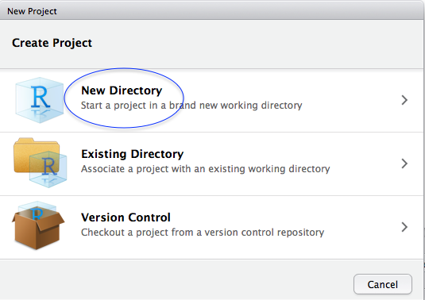
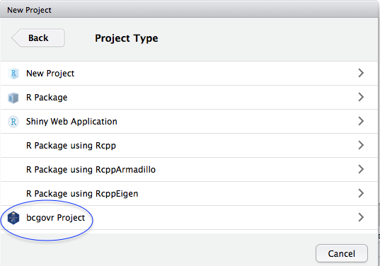
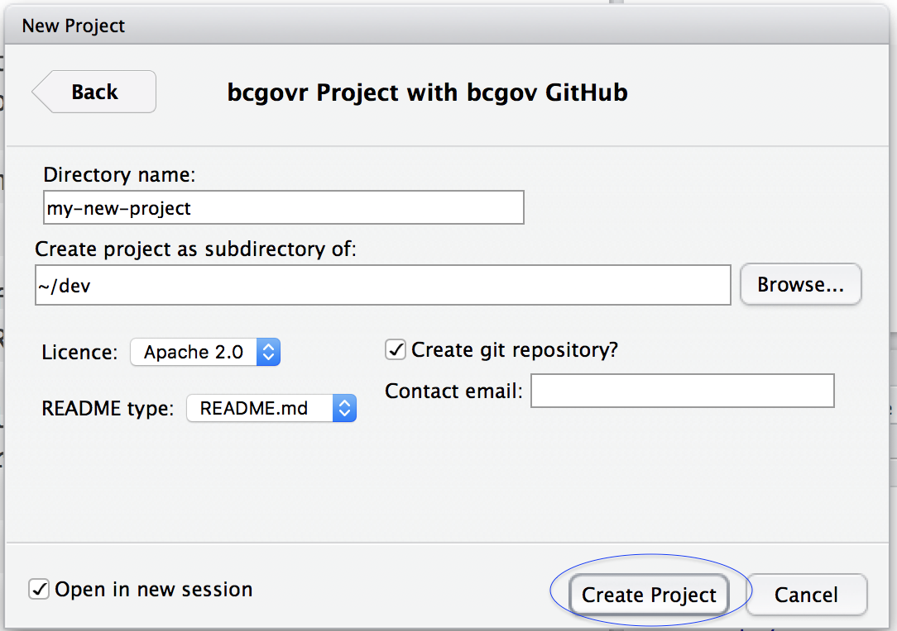
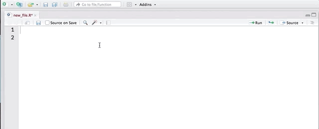
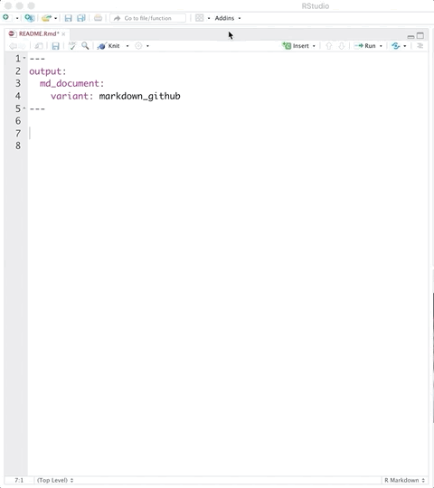

---
output:
  github_document:
    html_preview: true
---

<!-- README.md is generated from README.Rmd. Please edit README.Rmd (this file) -->

```{r, echo = FALSE}
knitr::opts_chunk$set(
  collapse = TRUE,
  comment = "#>",
  fig.path = "tools/readme/"
)

```

# bcgovr 

<!-- badges: start -->
[](https://opensource.org/licenses/Apache-2.0)
[](https://github.com/bcgov/repomountie/blob/master/doc/lifecycle-badges.md)
[](https://github.com/bcgov/bcgovr/actions/workflows/R-CMD-check.yaml)

<!-- badges: end -->


## Overview

An [R](http://r-project.org) package to automate set up and sharing of R projects in [bcgov GitHub](https://github.com/bcgov) following [bcgov guidelines](https://github.com/bcgov/BC-Policy-Framework-For-GitHub).

All B.C. Government employees are responsible for determining whether bcgov R source code can be shared on [bcgov GitHub](https://github.com/bcgov) and for following the [BC-Policy-Framework-For-GitHub](https://github.com/bcgov/BC-Policy-Framework-For-GitHub).

You will need to ensure that [Git](https://git-scm.com/) is installed on your computer. To add your project to bcgov GitHub users need to have a GitHub account _and_ be a [member of the bcgov GitHub organisation](https://github.com/bcgov/BC-Policy-Framework-For-GitHub/blob/master/BC-Gov-Org-HowTo/Cheatsheet.md). 

## Features

### Functions

`create_bcgov_project()` & `create_bcgov_package()` Create a new&mdash;or populate an existing&mdash;R project or R package with folders & files that encourage best practice in scientific computing _and_ with files that ensure the project meets [bcgov GitHub requirements](https://github.com/bcgov/BC-Policy-Framework-For-GitHub/blob/master/BC-Gov-Org-HowTo/Cheatsheet.md).

`use_bcgov_git()` Initialise [Git](https://git-scm.com/) version control for an R project _and_ add files that ensure the project meets [bcgov GitHub requirements](https://github.com/bcgov/BC-Policy-Framework-For-GitHub/blob/master/BC-Gov-Org-HowTo/Cheatsheet.md).

`use_bcgov_github()` Open a [bcgov GitHub repository](https://github.com/bcgov) and synchronise with an existing local R project _and_ add files that ensure the project meets [bcgov GitHub requirements](https://github.com/bcgov/BC-Policy-Framework-For-GitHub/blob/master/BC-Gov-Org-HowTo/Cheatsheet.md). `use_bcgov_github()` requires that your project already be a Git repository. Use `use_bcgov_git()` to initialise a Git repository.

`create_from_bcgov_github()`  Clone a [bcgov GitHub repository](https://github.com/bcgov) _and_ add files that ensure the project meets [bcgov GitHub requirements](https://github.com/bcgov/BC-Policy-Framework-For-GitHub/blob/master/BC-Gov-Org-HowTo/Cheatsheet.md).

`use_bcgov_req()` Add files to a new or existing R project to meet [bcgov GitHub requirements](https://github.com/bcgov/BC-Policy-Framework-For-GitHub/blob/master/BC-Gov-Org-HowTo/Cheatsheet.md). You can also add the [bcgov required files](https://github.com/bcgov/BC-Policy-Framework-For-GitHub/blob/master/BC-Gov-Org-HowTo/Cheatsheet.md) individually using `use_bcgov_contributing()`, `use_bcgov_licence()`, `use_bcgov_readme()`, `use_bcgov_readme_rmd()`, `use_bcgov_code_of_conduct()`.


### RStudio bcgovr Project & Package Templates

The `create_bcgov_project()` or `create_bcgov_package()` and `use_bcgov_git` functions can be used simultaneously through the *bcgovr Project & Package* templates in the [RStudio](https://www.rstudio.com/) New Project dialogue box. The dialogue box allows a user to create a new R project or package with the option to select and individualise the required bcgov GitHub files and initialise Git version control.


### RStudio Addins

The `bcgovr` package installs a set of [RStudio Addins](https://rstudio.github.io/rstudioaddins/):

(i) Insert the [boiler-plate Apache 2.0 license header](https://github.com/bcgov/BC-Policy-Framework-For-GitHub/blob/master/BC-Open-Source-Development-Employee-Guide/Licenses.md) into the comments header of a source file (uses `insert_bcgov_apache_header()`).
(ii) Insert the [boiler-plate Creative Commons Attribution 4.0 International License header](https://github.com/bcgov/BC-Policy-Framework-For-GitHub/blob/master/BC-Open-Source-Development-Employee-Guide/Licenses.md) into the comments header of a source file (uses `insert_bcgov_cc_header()`).
(iii) Insert a [bcgov project lifecycle badge](https://github.com/bcgov/repomountie/blob/master/doc/lifecycle-badges.md) into an .Rmd or .md file to indicate the current state of a project (uses `insert_bcgov_lifecycle_badge()`).


## Installation 

You can install `bcgovr` directly from this GitHub repository. To do so, you will need the [remotes](https://cran.r-project.org/package=remotes) package:

```{r, eval=FALSE}
install.packages("remotes")
```

Next, install and load the `bcgovr` package using `remotes::install_github()`:

```{r, eval=FALSE}
remotes::install_github("bcgov/bcgovr")
library(bcgovr)
```

`r emo::ji("tada")` The authors of `bcgovr` acknowledge and thank the authors of the [`usethis`](https://cran.r-project.org/package=usethis) R package&mdash;`bcgovr` uses `usethis` _a lot_. And by a lot, we mean _every_ `bcgovr` function uses `usethis` under the hood `r emo::ji("oncoming_automobile")`.


## Usage

### I WANT TO...

<details><summary><strong>Create a new bcgov R project or package with a 'ready-to-go' folder & file structure</strong></summary>

<br />

Create and open&mdash;or populate&mdash;a local R project using `bcgovr::create_bcgov_project()`. Be sure to either specify your local directory using the `path` argument, or `setwd("C:/my-new-project")` before running `create_bcgov_project()`. The template `bcgovr` folders and files and required bcgov GitHub files will be created in the new directory. For using different project templates, see the [Options](#options) section below. Type `?create_bcgov_project` in the R console for help.

```{r, eval = FALSE}
create_bcgov_project(path = "C:/my-new-project", coc_email = "my.email@gov.bc.ca") 
```

```
C:/my-new-project
├── 01_load.R
├── 02_clean.R
├── 03_analysis.R
├── 04_output.R
├── CODE_OF_CONDUCT.md
├── CONTRIBUTING.md
├── LICENSE
├── R
├── README.Rmd
├── data
├── my-new-project.Rproj
├── out
└── run_all.R
```


The `create_bcgov_package()` function is used the same way as `create_bcgov_project()` but will create all the folders & files to get started on creating an R package. Type `?create_bcgov_package` in the R console for help. The [R packages](http://r-pkgs.had.co.nz/) book by Hadley Wickham is a very useful resource if you are looking to create R packages.

```{r, eval = FALSE}
create_bcgov_package(path = "C:/mynewrpackage", coc_email = "my.email@gov.bc.ca") 
```

```
C:/mynewrpackage
├── CODE_OF_CONDUCT.md
├── CONTRIBUTING.md
├── DESCRIPTION
├── LICENSE
├── NAMESPACE
├── NEWS.md
├── R
├── README.Rmd
├── man
├── mynewrpackage.Rproj
└── vignettes
    └── mynewrpackage.Rmd
```

Users can also use the *bcgovr Project & Package* templates in the [RStudio](https://www.rstudio.com/) New Project dialogue box to create a new R project or package. The dialogue box provides the option to select and individualise the required bcgov GitHub files and initialise Git version control.

```{r echo=FALSE, out.width = "30%"}
 
 
 
```

<br />

</details>


<details><summary><strong>Initialise Git version control for my R project (<i>without</i> GitHub)</strong></summary>

<br />

Put your local R project under version control by initialising a [Git](https://git-scm.com/) repository using `use_bcgov_git()`&mdash;this automatically completes staging and committing of the initial folders & files inside the project. The `use_bcgov_git()` function also ensures the project has the required bcgov GitHub files. Type `?use_bcgov_git` in the R console for help.

```{r, eval = FALSE}
use_bcgov_git(coc_email = "my.email@gov.bc.ca") 
```

<br />

</details>


<details><summary><strong>Open a bcgov GitHub repository and synchronise with my R project</strong></summary>

<br />

Share your R project on [bcgov GitHub](https://github.com/bcgov) using `use_bcgov_github()`. This requires that your project already be a Git repository&mdash;use `use_bcgov_git()` to initialise a Git repository if necessary. The `use_bcgov_github()` function creates a repository on bcgov GitHub and adds and synchronises your local project with the newly created bcgov GitHub origin. The `use_bcgov_github()` function also ensures the project has the required bcgov GitHub files. Type `?use_bcgov_github` in the R console for help.

```{r, eval = FALSE}
use_bcgov_github(organisation = "bcgov", coc_email = "my.email@gov.bc.ca") 
```

<br />

</details>


<details><summary><strong>Clone and contribute to an existing bcgov GitHub repository</strong></summary>

<br />

Create a new local Git repository with a project or repository cloned from bcgov GitHub using `create_from_bcgov_github()`. The `create_from_bcgov_github()` function also ensures the project has the required bcgov GitHub files. Type `?create_from_bcgov_github` in the R console for help.

```{r, eval = FALSE}
create_from_bcgov_github(repo = "bcgov/bcgovr", destdir = "C:/my_directory") 
```

<br />

</details>


<details><summary><strong>Add all or some of the required bcgov GitHub files to my R project</strong></summary>

<br />

Add the [required bcgov GitHub](https://github.com/bcgov/BC-Policy-Framework-For-GitHub/blob/master/BC-Gov-Org-HowTo/Cheatsheet.md) files&mdash;a LICENCE, a README, a CODE OF CONDUCT and a CONTRIBUTING file&mdash;to any new or existing bcgov R project or package using `use_bcgov_req()`. Type `?use_bcgov_req` in the R console for help.

You can use the `licence`, `coc_email` & `rmarkdown` arguments to change the default Apache 2.0 License, add your contact details to the Code of Conduct, or decline a README.Rmd file&mdash;maybe you only want a README.md for the project?

```{r, eval=FALSE}
use_bcgov_req(licence = "cc-by", rmarkdown = FALSE, coc_email = "my.email@gov.bc.ca")
```

You can also add the individual required files as needed using:

```{r, eval=FALSE}
use_bcgov_licence()
use_bcgov_readme()
use_bcgov_contributing()
use_bcgov_code_of_conduct(coc_email = "my.email@gov.bc.ca")
```

<br />

</details>


<details><summary><strong>Insert a licence header into my source file</strong></summary>

<br />

Need to add that Apache 2.0 or Creative Commons License header to a source file? Just click-click:



You can also use `insert_bcgov_apache_header()` or `insert_bcgov_cc_header()`.

<br />

</details>


<details><summary><strong>Insert a bcgov project lifecycle badge into my README file</strong></summary>

<br />

Want to add a lifecycle badge to your README file to indicate the current state of the project? Just click-click-click-click:



You can also use `insert_bcgov_lifecycle_badge("experimental")`. Type `?insert_bcgov_lifecycle_badge` in the R console for the list of badge options and other help.

</details>


### Options

There are several options you can specify in your `.Rprofile` file to customise the default behaviour when using the `create_bcgov_` and `use_bcgov_` functions in `bcgovr`.

* `bcgovr.coc.email`: Code of Conduct contact email address
* `bcgovr.dir.struct`: Alternative project directory structure for `create_bcgov_project()`. This should be specified as a character vector of directory (i.e. folders) and file paths, relative to the root of the project.  Directories should be identified by having a trailing forward-slash (e.g., `"dir/"`).
    
    The default is: `c("R/", "data/", "out/", "01_load.R", "02_clean.R", "03_analysis.R", "04_output.R", "internal.R", "run_all.R")`.

To make use of these options, there should be a section in your `.Rprofile` file that looks something like this:

```r
if (interactive()) {
    options("bcgovr.coc.email" = "my.email@gov.bc.ca")
    options("bcgovr.dir.struct" = c("doc/", "data/", "results/", "src/01_load.R", "src/02_clean.R",
            "src/03_analysis.R", "src/04_output.R", "src/run_all.R"))
}
```

The easiest way to edit your `.Rprofile` is to run `usethis::edit_r_profile()`. It will open 
up the file in RStudio for editing. Then save the file, restart R, and your settings 
will be saved.

## Project Status

This package is relatively stable and available for general use.

## Getting Help or Reporting an Issue

To report bugs/issues/feature requests, please file an [Issue](https://github.com/bcgov/bcgovr/issues/).


## How to Contribute

If you would like to contribute to the package, please see our 
[CONTRIBUTING](CONTRIBUTING.md) guidelines.

Please note that this project is released with a [Contributor Code of Conduct](CODE_OF_CONDUCT.md). By participating in this project you agree to abide by its terms.


## License

    Copyright 2017 Province of British Columbia

    Licensed under the Apache License, Version 2.0 (the "License");
    you may not use this file except in compliance with the License.
    You may obtain a copy of the License at 

       http://www.apache.org/licenses/LICENSE-2.0

    Unless required by applicable law or agreed to in writing, software
    distributed under the License is distributed on an "AS IS" BASIS,
    WITHOUT WARRANTIES OR CONDITIONS OF ANY KIND, either express or implied.
    See the License for the specific language governing permissions and
    limitations under the License.


This repository is maintained by [Environmental Reporting BC](http://www2.gov.bc.ca/gov/content?id=FF80E0B985F245CEA62808414D78C41B). Click [here](https://github.com/bcgov/EnvReportBC-RepoList) for a complete list of our repositories on GitHub.
