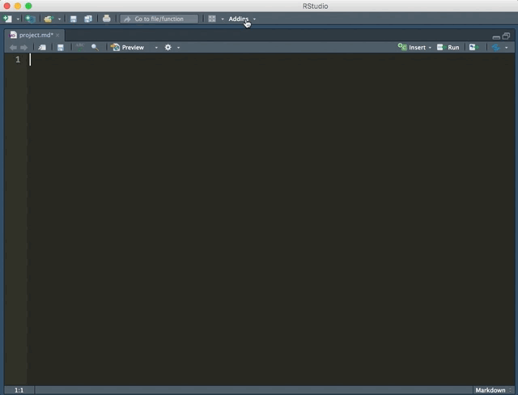
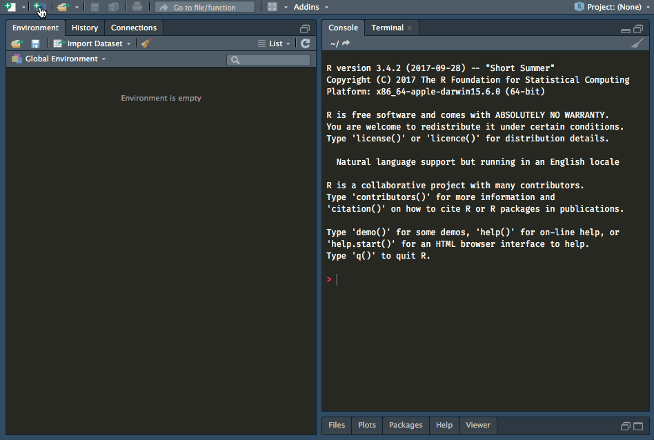
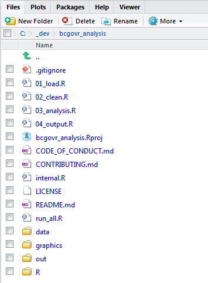

---
output:
  github_document:
    html_preview: true
---

<!-- README.md is generated from README.Rmd. Please edit README.Rmd (this file) -->

```{r, echo = FALSE}
knitr::opts_chunk$set(
  collapse = TRUE,
  comment = "#>",
  fig.path = "img/README-"
)
```

# bcgovr 

<div id="devex-badge"><a rel="Delivery" href="https://github.com/BCDevExchange/assets/blob/master/README.md"></a>[](https://travis-ci.org/bcgov/bcgovr)</div>


## Overview

An [R](http://r-project.org) package to set up bcgov R projects & packages following [bcgov GitHub guidelines](https://github.com/bcgov/BC-Policy-Framework-For-GitHub). 

All B.C. Government employees are responsible for determining whether bcgov R source code can be shared on [bcgov GitHub](https://github.com/bcgov) following the [BC-Policy-Framework-For-GitHub](https://github.com/bcgov/BC-Policy-Framework-For-GitHub).

## Features

### Functions
`use_bcgov_github` Open a new bcgov R project with local version control, a GitHub repository and add files that ensure the project meets [bcgov GitHub requirements](https://github.com/bcgov/BC-Policy-Framework-For-GitHub/blob/master/BC-Gov-Org-HowTo/Cheatsheet.md).

`use_bcgov_git` Open a new bcgov R project with local version control and add files that ensure the project meets [bcgov GitHub requirements](https://github.com/bcgov/BC-Policy-Framework-For-GitHub/blob/master/BC-Gov-Org-HowTo/Cheatsheet.md).

`create_bcgov_project` & `create_bcgov_package` Create a new&mdash;or populate an existing&mdash;R project or package with folders & files that encourage best practice in scientific computing _and_ with files that ensure the project meets [bcgov GitHub requirements](https://github.com/bcgov/BC-Policy-Framework-For-GitHub/blob/master/BC-Gov-Org-HowTo/Cheatsheet.md). These functions can also be used by selecting the [*bcgovr Project Template*](#analysis-and-package-templates) in the [RStudio](https://www.rstudio.com/) New Project dialog box.

`use_bcgov_req` Add files to a new or existing R project that ensure the project meets [bcgov GitHub requirements](https://github.com/bcgov/BC-Policy-Framework-For-GitHub/blob/master/BC-Gov-Org-HowTo/Cheatsheet.md). You can also add the [required files](https://github.com/bcgov/BC-Policy-Framework-For-GitHub/blob/master/BC-Gov-Org-HowTo/Cheatsheet.md) individually using `use_bcgov_contributing`, `use_bcgov_licence`, `use_bcgov_readme`, `use_bcgov_code_of_conduct`.


### Addins

The `bcgovr` package installs a set of [RStudio Addins](https://rstudio.github.io/rstudioaddins/):

(i) Insert the [boiler-plate Apache 2.0 license header](https://github.com/bcgov/BC-Policy-Framework-For-GitHub/blob/master/BC-Open-Source-Development-Employee-Guide/Licenses.md) into the comments header of a source file (uses `insert_bcgov_apache_header`).
(ii) Insert the [boiler-plate Creative Commons Attribution 4.0 International License header](https://github.com/bcgov/BC-Policy-Framework-For-GitHub/blob/master/BC-Open-Source-Development-Employee-Guide/Licenses.md) into the comments header of a source file (uses `insert_bcgov_cc_header`).
(iii) Insert a [BCDevExchange project state badge](https://github.com/BCDevExchange/assets/blob/master/README.md) into an .Rmd or .md file (uses `insert_bcgov_devex_badge`).

## Installation 

You can install `bcgovr` directly from this GitHub repository. To do so, you will need the [remotes](https://cran.r-project.org/web/packages/remotes/index.html) package:

```{r, eval=FALSE}
install.packages("remotes")
```

Next, install and load the `bcgovr` package using `remotes::install_github()`:

```{r, eval=FALSE}
remotes::install_github("bcgov/bcgovr")
library(bcgovr)
```


## Usage

### RStudio Addins

**Apache 2.0 License Header**

Need to insert that Apache 2.0 license header to a new .R or .Rmd file? Just click-click:


**BCDevExchange Project State Badge**

Need to add a project state badge to your .md or .Rmd file? Just click-click-click:




### Analysis and Package Templates

`bcgovr` allows you to set up a new R-based open source data analysis project (or package) with folders & files that encourage best practice in scientific computing and including all of the [required bcgov items](https://github.com/bcgov/BC-Policy-Framework-For-GitHub/blob/master/BC-Gov-Org-HowTo/Cheatsheet.md).

The easiest way to set up a new project is to use the bcgovr project template through RStudio:

#### Step 1: Set up a [remote repository](https://help.github.com/articles/about-remote-repositories/)

For a remote in [github.com/bcgov](github.com/bcgov), click on the green **New** button to create a new repository. [Choose a repository name](https://github.com/bcgov/BC-Policy-Framework-For-GitHub/blob/master/BC-Gov-Org-HowTo/Naming-Repos.md)&mdash;our example repository name is `bcgovr_analysis`. You should open an empty repository&mdash;without initializing a README, a .gitignore file or a license&mdash;as `bcgovr` will take care of all of that for you later. Copy the URL of the repository, you'll need it to set up your local repository in the next step.


#### Step 2: Set up & populate local repository using `bcgovr`

*RStudio GUI users:* Open a fresh session of RStudio. Start a New Project: New Project -> New Directory -> BC Gov Analysis/Package Skeleton. Confirm local location of your new project in the _Directory Name_ field, and paste the URL of the github.com/bcgov repository from step 1 in the _Repository URL_ field. Check/uncheck, and fill in the other fields as relevant to your project, and Click 'Create Project'. The  bcgov template files and folders will be created in the new directory, and your local project is now "connected" to your remote in [github.com/bcgov](github.com/bcgov). For different folder templates, see the [Options](#options) section below.



The result is a [bcgov](https://github.com/bcgov) 'ready-to-go' local directory for a new data analysis project:



#### Step 3: Stage, Commit & Push local repository folders & files to remote repository

*RStudio GUI users:* Now you are ready to Stage, Commit & Push changes in your local repository to the remote repository in [github.com/bcgov](github.com/bcgov). Using the functions in the Git tab in RStudio, you can Stage your changes by selecting files, Commit the staged changes---including informative commit messages---and Push the changes to the remote repository. Remember to make use of the .gitignore file for files & folders you do *not* want to keep under version control (e.g. outputs or source data sets), and to use the Pull function before you start work to ensure your local repository is up-to-date with the remote repository.

*Git Command Line Users:* Stage, Commit & Push changes in your local repository to the remote repository in [github.com/bcgov](github.com/bcgov) using the Command Line (e.g. [Git Bash](https://git-scm.com/downloads) or Terminal).

```{r, engine = 'sh', eval = FALSE}
git status # see what file(s) are new or have changed
git add README.md # stage the README file
git commit -m "First commit of README file" # commit the file with an informative message
git push origin master # push the changes in your local repository up to the remote repository
```

You can use the Command Line to [confirm or add the remote url for an existing local project](https://help.github.com/articles/adding-a-remote/). Checkout [GitHubHelp](https://help.github.com/) for more resources for using Git and the Command Line. The [Happy Git and GitHub for the useR](http://happygitwithr.com/) e-book is a great, free resource for learning and using Git and GitHub with R.

```{r, engine = 'sh', eval = FALSE}
git remote -v # verifies the new remote URL
git remote add origin https://github.com/bcgov/bcgovr_analysis.git # sets the remote
```

### Options

There are several options you can specify in your `.Rprofile` file to customise the default behaviour when creating projects and packages with `bcgovr`:

* `bcgovr.coc.email`: Code of Conduct contact email address
* `bcgovr.dir.struct`: Alternative project directory structure. This should be specified as
    a character vector of directory and file paths (relative to the root of the project). 
    Directories should be identified by having a trailing forward-slash (e.g., `"dir/"`).
    
    The default is: `c("R/","out/", "graphics/", "data/", "01_load.R", "02_clean.R", "03_analysis.R", "04_output.R", "internal.R", "run_all.R")`.

To make use of these options, there should be a section in your `.Rprofile` file that looks something like this:

```r
if (interactive()) {
    options("bcgovr.coc.email" = "my.email@gov.bc.ca")
    options("bcgvor.dir.struct" = c("doc/", "data/", "bin/", "results/", "src/01_load.R", "src/02_clean.R",
            "src/03_analysis.r", "src/04_output.R", "src/runall.R"))
} 
```

### Project Template Functions

#### analysis_skeleton

As an alternative to using the 'New Project -> ...' dialogue in RStudio, you can use the R console and `bcgovr::analysis_skeleton()` to create a new local project. You can specify the URL of the remote repository (from step 1 above) using the `git_clone` argument. Be sure to either specify your new analysis local directory using the `path` argument, or `setwd("C:/my_bcgov_analysis")` before running `analysis_skeleton()`. Type `?analysis_skeleton` in the R console for help.

```{r, eval = FALSE}
bcgovr::analysis_skeleton(path = "C:\_dev\bcgovr_analysis", git_clone = "url of remote repository") 
```

#### package_skeleton

The `package_skeleton()` function is used the same way as `analysis_skeleton()` but will create all the files & folders to get started on creating an R package. Type `?package_skeleton` in the R console for help. The [R packages](http://r-pkgs.had.co.nz/) book by Hadley Wickham is an incredible resource if you are looking to create packages.


## Project Status

This package is under active development.


## Getting Help or Reporting an Issue

Once you have R & RStudio [installed on your machine](https://github.com/bcgov/bcgov-data-science-resources/wiki/Installing-R-&-RStudio), open up RStudio so 

To report bugs/issues/feature requests, please file an [Issue](https://github.com/bcgov/bcgovr/issues/).


## How to Contribute

If you would like to contribute to the package, please see our 
[CONTRIBUTING](CONTRIBUTING.md) guidelines.

Please note that this project is released with a [Contributor Code of Conduct](CODE_OF_CONDUCT.md). By participating in this project you agree to abide by its terms.


## License

    Copyright 2017 Province of British Columbia

    Licensed under the Apache License, Version 2.0 (the "License");
    you may not use this file except in compliance with the License.
    You may obtain a copy of the License at 

       http://www.apache.org/licenses/LICENSE-2.0

    Unless required by applicable law or agreed to in writing, software
    distributed under the License is distributed on an "AS IS" BASIS,
    WITHOUT WARRANTIES OR CONDITIONS OF ANY KIND, either express or implied.
    See the License for the specific language governing permissions and
    limitations under the License.

This repository is maintained by [Environmental Reporting BC](http://www2.gov.bc.ca/gov/content?id=FF80E0B985F245CEA62808414D78C41B). Click [here](https://github.com/bcgov/EnvReportBC-RepoList) for a complete list of our repositories on GitHub.
